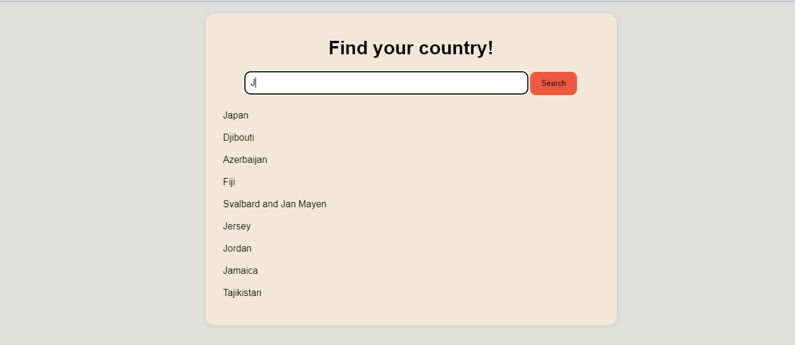

# AJAX Type-Ahead with Vanilla Javascript.
This project implements an AJAX type-ahead feature using vanilla JavaScript. Users can search for countries and get real-time search suggestions based on the input. The project fetches data from the restcountries API to provide search suggestions.

## Features
- Real-time search suggestions as users type into the search input field.
- Smooth interaction with user-friendly animations and transitions.
- Responsive design for both desktop and mobile devices.
- Error handling for API requests, displaying user-friendly error messages.
- Graceful handling of edge cases, such as empty input or no matching results.

## Demo
- Live Demo (https://ajax-ta.netlify.app/)
- Screenshot of project: 

### Acknowledgment
Project was given by Checklearn to test skills on API integration, UI/UX design and coding proficiency in vanilla Javascript